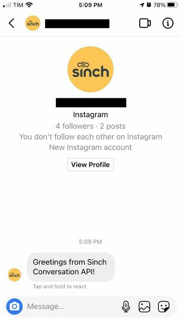
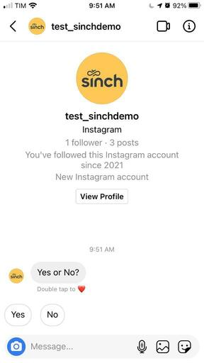
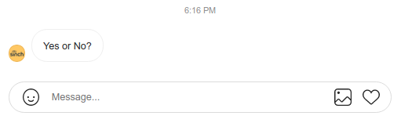
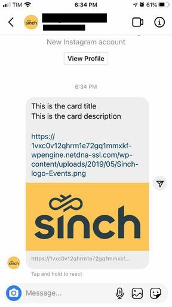
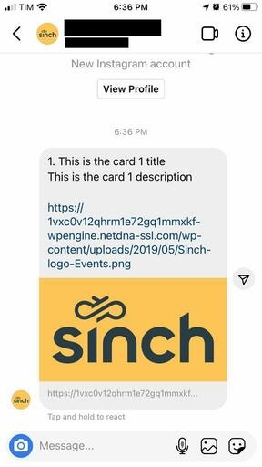
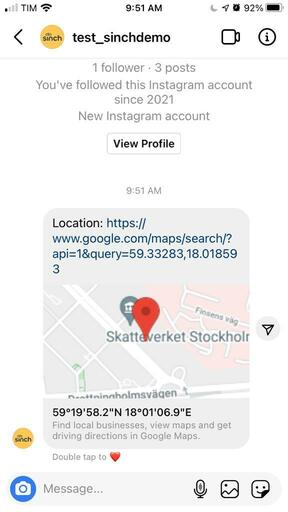

Using Conversation API, clients are able to integrate with Instagram platform and able to support customer care
functionality. Instagram requires that the end-user (aka recipient, a contact) must initiate the request first and then
the client can send a reply to the contact. To configure an Instagram Account and connect it to Conversation API  **app**, 
follow the instructions below:

Before you start, you will need access to the following:

* An Instagram business account, that will receive and send messages
* A Facebook page connected with that account
* A Facebook developer account that can perform tasks on that page
* A registered Facebook app with basic settings configured
* An Instagram Authentication Token

To understand how to have all the above points, you can follow the [**Instagram Getting Started guide**](doc:conversation-instagram-setup).

### Setting up Instagram as a Conversation API Channel

After you have followed the above mentioned guide, you should have the Instagram Access Token in hand, and then you need
to configure the Instagram integration for your Conversation API **app**. The easiest way to do that is to use
[Sinch Portal](https://dashboard.sinch.com/convapi/overview). Login to the portal and then try to create a new **app** or
update an existing **app** and click on "SET UP CHANNEL" beside the Instagram channel.

Alternatively you can use the management API and specify the `channel_credentials` for Instagram when creating or updating your app. 

Example of the channel configuration is given in the snippet below:

```json
{
  "channel_credentials": [
    {
      "channel": "INSTAGRAM",
      "instagram_credentials": {
        "token": "{{INSTAGRAM_ACCESS_TOKEN}}"
      }
    }
  ],
  "display_name": "App name"
}
```

> 📘 Note
>
> For the use of Instagram messaging service, you can configure Callback Validation between Instagram and Conversation API so that we can make sure, that the callbacks are valid.
>
> This can be done via the portal when configuring your Instagram channel, or by adding `"callback_secret": "<string>"` to the `"channel_credentials"` object in the snippet above.
>
> The secret for this validation in the case of Instagram is your App Secret from your Facebook App.


### Setting up Instagram to forward callbacks to Conversation API

Once you have created a Conversation API app, go back to **Instagram setup page**, find **Webhooks** section (just below **Access Tokens**), click **Add Callback URL** button and fill in with the following data (**remember to put region (eu1 or us1) and your Conversation App ID in the callback URL**):

**Callback URL:** `https://instagram-adapter.{{REGION}}.conversation-api.prod.sinch.com/adapter/v1/{{CONVERSATION_APP_ID}}/callback`

**Verify Token:** `c5a8751a-e52b-4d39-a1f3-456d4a03b762`

After clicking **Verify and Save**, if no errors occurred, a table in the **Webhooks** section will appear, with your **Facebook Page** listed within. Click **Add Subscriptions** button, check all boxes and click **save**.

This is enough for test and development purposes, you don't have to fill **Details** section nor submit it for review. Now you can send messages anyone that has been granted either the Administrator, Developer or Tester role for your app.

### Setting up Conversation API to forward callbacks to your service

You can add a webhook to your Conversation API **app** using the [Sinch Portal](https://dashboard.sinch.com/convapi/overview) or the management API.

Example snippet for creating webhook programmatically:

```json
{
  "app_id": "{{APP}}",
  "target": "{{WEBHOOK_URL}}",
  "target_type": "HTTP",
  "triggers": [
    "MESSAGE_DELIVERY",
    "EVENT_DELIVERY",
    "MESSAGE_INBOUND",
    "EVENT_INBOUND",
    "CONVERSATION_START",
    "CONVERSATION_STOP",
    "UNSUPPORTED"
  ]
}
```

Finally, visit your Instagram Profile as a user with proper role granted (preferably the one who created the page) and try sending a message to it - remember that a user has to start the conversation. If everything works fine, you should receive the message you've just sent:

```json
{
  "app_id": "01F6T8M717SPW0186EC5A90Z0E",
  "accepted_time": "2021-05-30T21:57:05.043890Z",
  "event_time": "2021-05-30T21:57:04.198Z",
  "project_id": "5b7c830f-4183-4275-a028-13e40c98e29e",
  "message": {
    "id": "01F6ZMFKRHKW7E0P58M9VM041G",
    "direction": "TO_APP",
    "contact_message": {
      "text_message": {
        "text": "Hello World Instagram"
      }
    },
    "channel_identity": {
      "channel": "INSTAGRAM",
      "identity": "3964920326927846",
      "app_id": "01F6T8M717SPW0186EC5A90Z0E"
    },
    "conversation_id": "01F6T8NG7D6M3Y0DT0RMDP1KFE",
    "contact_id": "01F6T8NG3ZWF460K28RHAM1DHW",
    "metadata": "",
    "accept_time": "2021-05-30T21:57:04.981939Z"
  }
}
```

Now, with a conversation created automatically, you can use the received **contact_id** to send a response for this user:

```json
{
  "app_id": "{{APP_ID}}",
  "recipient": {
    "contact_id": "{{CONTACT_ID}}"
  },
  "message": {
    "text_message": {
      "text": "Text message from Sinch Conversation API."
    }
  },
  "channel_properties": {
    "INSTAGRAM_MESSAGE_TAG": "HUMAN_AGENT"
  },
  "channel_priority_order": [
    "INSTAGRAM"
  ]
}
```

You should receive callbacks with information that the message has been delivered and read.

The channel is now configured.

### Rich Message Support

This section provides detailed information about what type of rich messages are natively supported by Instagram channel and
what transcoding is applied in other cases.

#### Sending Messages

Here we give a mapping between Conversation API generic message format and the Instagram rendering on mobile devices.

Please note that for the sake of brevity the JSON snippets do not include the **recipient** and **app_id** which are both required when sending a message.

If you want to send messages outside the standard 24 hours response window you can do that by adding Instagram channel specific properties in your message request.

For more info check out [**Channel Specific Properties**](doc:conversation-channel-properties).

##### Text Messages

---

Conversation API POST `messages:send`

```json
{
  "message": {
    "text_message": {
      "text": "Greetings from Sinch Conversation API!"
    }
  }
}
```

The rendered message:



##### Media Messages

---

Conversation API POST `messages:send`

```json
{
  "message": {
    "media_message": {
      "url": "https://latam.sinch.com/wp-content/uploads/2021/03/Sinch-Anthem-v2.png"
    }
  }
}
```

The rendered message:


> 📘 Note
>
> Until Instagram enables sending other types of media other than images, we will transcode your "Media Message" as a “Text Message” with a plain text URL that points to the document/video file.

##### Choice Messages

---

Conversation API POST `messages:send`

```json
{
  "message": {
    "choice_message": {
      "text_message": {
        "text": "Yes or No?"
      },
      "choices": [
        {
          "text_message": {
            "text": "Yes"
          },
          "postback_data": "choice_y"
        },
        {
          "text_message": {
            "text": "No"
          },
          "postback_data": "choice_n"
        }
      ]
    }
  }
}
```

The rendered message:



The web client rendered message:



> 📘 Note
>
> `Choice Message` will only be supported on Android and iOS Instagram’s apps. Choice message will not be rendered on a web client. Instead, Users will see just the text message without the choice buttons.

##### Card Messages

---

Conversation API POST `messages:send`

```json
{
  "message": {
    "card_message": {
      "title": "This is the card title",
      "description": "This is the card description",
      "media_message": {
        "url": "https://1vxc0v12qhrm1e72gq1mmxkf-wpengine.netdna-ssl.com/wp-content/uploads/2019/05/Sinch-logo-Events.png"
      }
    }
  }
}
```

The rendered message:



> 📘 Note
> 
> Card messages are not supported natively by Instagram, so, we will transcode the "Card Message" as a "Text Message".

#### Carousel Messages

---

Conversation API POST `messages:send`

```json
{
  "message": {
    "carousel_message": {
      "cards": [
        {
          "title": "This is the card 1 title",
          "description": "This is the card 1 description",
          "media_message": {
            "url": "https://1vxc0v12qhrm1e72gq1mmxkf-wpengine.netdna-ssl.com/wp-content/uploads/2019/05/Sinch-logo-Events.png"
          }
        }
      ]
    }
  }
}
```

The rendered message:



> 📘 Note
> 
> Carousel messages are not supported natively by Instagram, so, we will transcode the "Carousel Message" as a "Text Message".

#### Location Messages

---

Conversation API POST `messages:send`

```json
{
  "message": {
    "location_message": {
      "title": "Location Message",
      "coordinates": {
        "latitude": 55.610479,
        "longitude": 13.002873
      }
    }
  }
}
```

The rendered message:



> 📘 Note
> 
> Location messages are not supported natively by Instagram, so, we will transcode the "Location Message" as a "Text Message" which contains a URL that points to the Google Maps app.

### Receiving Messages

Instagram channel supports various kinds of contact messages - text, media, quick replies, icebreakers, story replies, story mention and media share. All of these are delivered by Conversation API with POST to `MESSAGE_INBOUND` webhook. Some specific types of media can also be delivered with POST to `UNSUPPORTED` webhook due to Instagram lack of support in Business Accounts, are them: IGTV/Reels share, media share from private accounts, voice messages and GIPHYs.

---

Example text:

```json
{
  "app_id": "01F6T8M717SPW0186EC5A90Z0E",
  "accepted_time": "2021-05-30T21:57:05.043890Z",
  "event_time": "2021-05-30T21:57:04.198Z",
  "project_id": "5b7c830f-4183-4275-a028-13e40c98e29e",
  "message": {
    "id": "01F6ZMFKRHKW7E0P58M9VM041G",
    "direction": "TO_APP",
    "contact_message": {
      "text_message": {
        "text": "Hello"
      }
    },
    "channel_identity": {
      "channel": "INSTAGRAM",
      "identity": "3964920326927846",
      "app_id": "01F6T8M717SPW0186EC5A90Z0E"
    },
    "conversation_id": "01F6T8NG7D6M3Y0DT0RMDP1KFE",
    "contact_id": "01F6T8NG3ZWF460K28RHAM1DHW",
    "metadata": "",
    "accept_time": "2021-05-30T21:57:04.981939Z"
  }
}
```

---

Example Media:

```json
{
  "app_id": "01F6T8M717SPW0186EC5A90Z0E",
  "accepted_time": "2021-05-30T22:00:08.160953Z",
  "event_time": "2021-05-30T22:00:04.654Z",
  "project_id": "5b7c830f-4183-4275-a028-13e40c98e29e",
  "message": {
    "id": "01F6ZMN6KDYRQJ0YFS14J21ZAM",
    "direction": "TO_APP",
    "contact_message": {
      "media_message": {
        "url": "https://lookaside.fbsbx.com/ig_messaging_cdn/?asset_id=17965090030414009&signature=AbwaqAK9-9W3Srei7Xmb7n2cmz_-29VpeaoF2o_0PZKMkjG80p0HjSpmcdgJp11ocVdCCiuT_bhQ7KSUuUPxZmth8ce-N8hR3e4NrShN2ZM2JmrOl5ZEePls66E7QAYKpvnVDTKVsVD4Wb2iFXLEVbTbgF7fmIGLo3jXasLeDDkoMV23JA",
        "thumbnail_url": "https://lookaside.fbsbx.com/ig_messaging_cdn/?asset_id=17965090030414009&signature=AbwaqAK9-9W3Srei7Xmb7n2cmz_-29VpeaoF2o_0PZKMkjG80p0HjSpmcdgJp11ocVdCCiuT_bhQ7KSUuUPxZmth8ce-N8hR3e4NrShN2ZM2JmrOl5ZEePls66E7QAYKpvnVDTKVsVD4Wb2iFXLEVbTbgF7fmIGLo3jXasLeDDkoMV23JA"
      }
    },
    "channel_identity": {
      "channel": "INSTAGRAM",
      "identity": "3964920326927846",
      "app_id": "01F6T8M717SPW0186EC5A90Z0E"
    },
    "conversation_id": "01F6T8NG7D6M3Y0DT0RMDP1KFE",
    "contact_id": "01F6T8NG3ZWF460K28RHAM1DHW",
    "metadata": "",
    "accept_time": "2021-05-30T22:00:08.095568Z"
  }
}
```

---

Example Quick Reply:

```json
{
  "app_id": "01F6T8M717SPW0186EC5A90Z0E",
  "accepted_time": "2021-05-30T22:03:09.244231Z",
  "event_time": "2021-05-30T22:03:06.344Z",
  "project_id": "5b7c830f-4183-4275-a028-13e40c98e29e",
  "message": {
    "id": "01F6ZMTQDHY3MK0S48QBH102HV",
    "direction": "TO_APP",
    "contact_message": {
      "choice_response_message": {
        "message_id": "01F6ZMTJNTSRF50T4EDNBX08HJ",
        "postback_data": "choice_yes"
      }
    },
    "channel_identity": {
      "channel": "INSTAGRAM",
      "identity": "3964920326927846",
      "app_id": "01F6T8M717SPW0186EC5A90Z0E"
    },
    "conversation_id": "01F6T8NG7D6M3Y0DT0RMDP1KFE",
    "contact_id": "01F6T8NG3ZWF460K28RHAM1DHW",
    "metadata": "",
    "accept_time": "2021-05-30T22:03:09.181128Z"
  }
}
```

---

Example icebreaker:

```json
{
  "app_id": "01F6T8M717SPW0186EC5A90Z0E",
  "accepted_time": "2021-05-30T22:01:45.364076Z",
  "event_time": "2021-05-30T22:01:44.467Z",
  "project_id": "5b7c830f-4183-4275-a028-13e40c98e29e",
  "message": {
    "id": "01F6ZMR5FN2JVH0X6ZEJ720BRN",
    "direction": "TO_APP",
    "contact_message": {
      "text_message": {
        "text": "Ice breaker text"
      }
    },
    "channel_identity": {
      "channel": "INSTAGRAM",
      "identity": "3964920326927846",
      "app_id": "01F6T8M717SPW0186EC5A90Z0E"
    },
    "conversation_id": "01F6T8NG7D6M3Y0DT0RMDP1KFE",
    "contact_id": "01F6T8NG3ZWF460K28RHAM1DHW",
    "metadata": "",
    "accept_time": "2021-05-30T22:01:45.294585Z"
  }
}
```

---

Example story reply:

```json
{
  "app_id": "01F6T8M717SPW0186EC5A90Z0E",
  "accepted_time": "2021-05-30T22:06:18.448186Z",
  "event_time": "2021-05-30T22:06:16.726Z",
  "project_id": "5b7c830f-4183-4275-a028-13e40c98e29e",
  "message": {
    "id": "01F6ZN0G58SMME0V2J8PCG1XN3",
    "direction": "TO_APP",
    "contact_message": {
      "media_card_message": {
        "url": "https://lookaside.fbsbx.com/ig_messaging_cdn/?asset_id=17934482515542967&signature=AbzZf9xi48_XSHNiyGhefmDpEDEb_EHg0sj6fuvzF0xCPlKPYesJR5m_kPNvNnpPO3NDiLhqAEPYwp7FiiXi7IbkTCqtQSsM7e7l4tiUdqGolWf2M8tbda8DWOmzRxX_8DqUu4W8VE752SuYstuQ1q02ZBUkx8Tcl2Z8y7rmNeAdDXoyOw",
        "caption": "Story reply text"
      }
    },
    "channel_identity": {
      "channel": "INSTAGRAM",
      "identity": "3964920326927846",
      "app_id": "01F6T8M717SPW0186EC5A90Z0E"
    },
    "conversation_id": "01F6T8NG7D6M3Y0DT0RMDP1KFE",
    "contact_id": "01F6T8NG3ZWF460K28RHAM1DHW",
    "metadata": "",
    "accept_time": "2021-05-30T22:06:18.384472Z"
  }
}
```

---

Example story mention:

```json
{
  "app_id": "01F6SM2J5JG7NP10HSZFH80DDK",
  "accepted_time": "2021-05-28T14:17:19.865915Z",
  "event_time": "2021-05-28T14:17:15.822Z",
  "project_id": "id-of-created-project",
  "message": {
    "id": "01F6SNC9KVC4QA0B5CJA3F01C5",
    "direction": "TO_APP",
    "contact_message": {
      "media_message": {
        "url": "https://lookaside.fbsbx.com/ig_messaging_cdn/?asset_id=17988851035358143&signature=AbwpO8_zezVsF3xAmVMQoWiUQsrN9rASmbo_v3pbAQOIdPnpL6LfgJ_4zNfk6_Kb-jEuTMc9erD0oEeVFC95fId77zWaAn1nU9C82zXXWDf029uCJKw9NO0b3cq7PRBQIqXmRj6K8IzAlbIJ5LTsqyS2vlBsOf4DjLsjPiG93brgWNMM1A",
        "thumbnail_url": ""
      }
    },
    "channel_identity": {
      "channel": "INSTAGRAM",
      "identity": "4165102890214238",
      "app_id": "01F6SM2J5JG7NP10HSZFH80DDK"
    },
    "conversation_id": "01F6SNC9R047F30W3B4NHK1RC2",
    "contact_id": "01F6SNC9NVV4D31P87FZP51AT7",
    "metadata": "",
    "accept_time": "2021-05-28T14:17:19.805777Z"
  }
}
```

---

Example media share:

```json
{
  "app_id": "01F6SM2J5JG7NP10HSZFH80DDK",
  "accepted_time": "2021-05-28T14:17:19.865915Z",
  "event_time": "2021-05-28T14:17:15.822Z",
  "project_id": "id-of-created-project",
  "message": {
    "id": "01F6SNC9KVC4QA0B5CJA3F01C5",
    "direction": "TO_APP",
    "contact_message": {
      "media_message": {
        "url": "https://lookaside.fbsbx.com/ig_messaging_cdn/?asset_id=17988851035358143&signature=AbwpO8_zezVsF3xAmVMQoWiUQsrN9rASmbo_v3pbAQOIdPnpL6LfgJ_4zNfk6_Kb-jEuTMc9erD0oEeVFC95fId77zWaAn1nU9C82zXXWDf029uCJKw9NO0b3cq7PRBQIqXmRj6K8IzAlbIJ5LTsqyS2vlBsOf4DjLsjPiG93brgWNMM1A"
      }
    },
    "channel_identity": {
      "channel": "INSTAGRAM",
      "identity": "4165102890214238",
      "app_id": "01F6SM2J5JG7NP10HSZFH80DDK"
    },
    "conversation_id": "01F6SNC9R047F30W3B4NHK1RC2",
    "contact_id": "01F6SNC9NVV4D31P87FZP51AT7",
    "metadata": "",
    "accept_time": "2021-05-28T14:17:19.805777Z"
  }
}
```

Example unsupported media:

```json
{
  "app_id": "01F6SM2J5JG7NP10HSZFH80DDK",
  "accepted_time": "2021-05-28T14:13:06.271849Z",
  "event_time": "2021-05-28T14:13:06.223973Z",
  "project_id": "id-of-created-project",
  "unsupported_callback": {
    "channel": "INSTAGRAM",
    "payload": "{\"object\":\"instagram\",\"entry\":[{\"time\":1622211185048,\"id\":\"id\",\"messaging\":[{\"sender\":{\"id\":\"sender-id\"},\"recipient\":{\"id\":\"recipient-id\"},\"timestamp\":1622211184495,\"message\":{\"mid\":\"message-mid\",\"is_unsupported\":true}}]}]}"
  }
}
``` 

### Receiving Delivery Receipts

Messages sent on Instagram channel can have three statuses: DELIVERED (Instagram Echo), READ (Instagram Seen) and FAILED. If the status is FAILED, the reason will include more information about the failure.

Below is an example for DELIVERED receipt - READ and FAILED differ by the `status` and `reason` only. Conversation API POST to `MESSAGE_DELIVERY` webhook:

```json
{
  "app_id": "01F6T8M717SPW0186EC5A90Z0E",
  "accepted_time": "2021-05-30T22:11:53.319Z",
  "event_time": "2021-05-30T22:11:54.260Z",
  "project_id": "5b7c830f-4183-4275-a028-13e40c98e29e",
  "message_delivery_report": {
    "message_id": "01F6ZNAQB7K25X1MHX2P6T1RE7",
    "conversation_id": "01F6T8NG7D6M3Y0DT0RMDP1KFE",
    "status": "DELIVERED",
    "channel_identity": {
      "channel": "INSTAGRAM",
      "identity": "3964920326927846",
      "app_id": "01F6T8M717SPW0186EC5A90Z0E"
    },
    "contact_id": "01F6T8NG3ZWF460K28RHAM1DHW",
    "metadata": ""
  }
}
```
