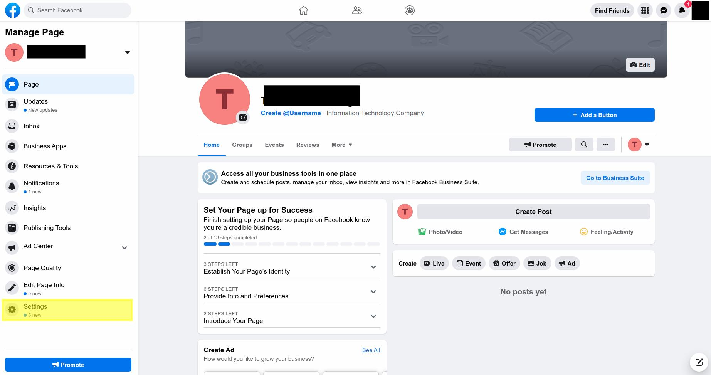
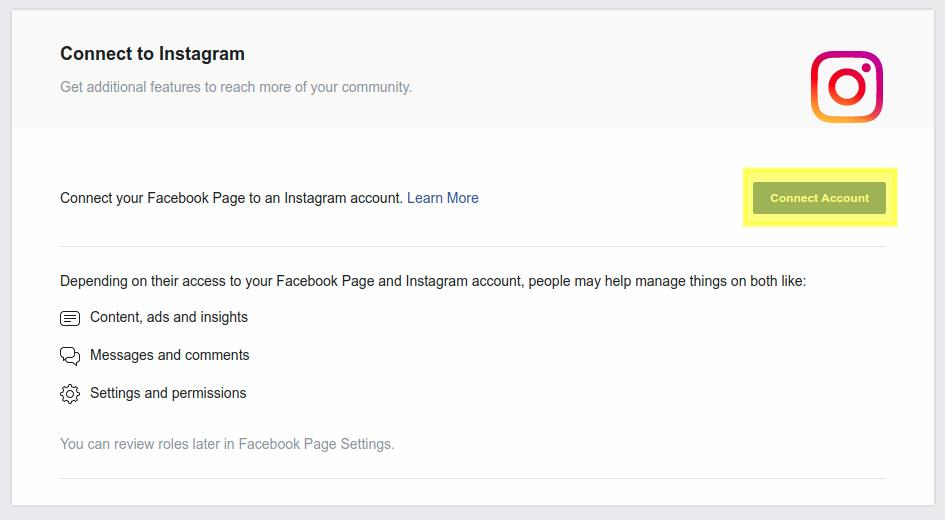
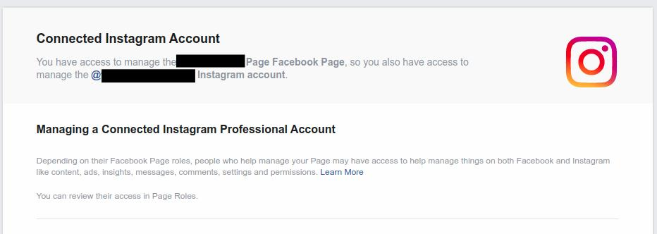
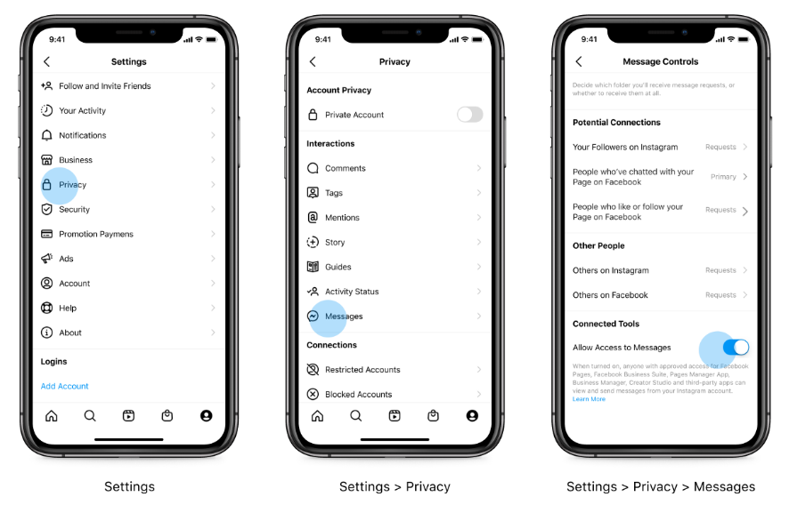
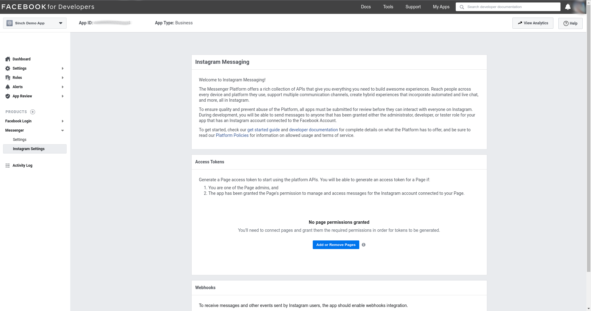
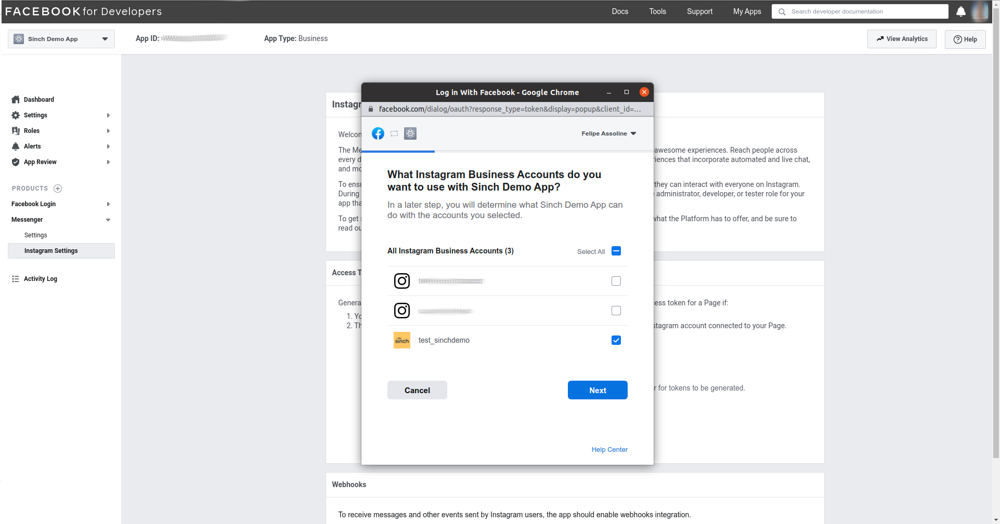
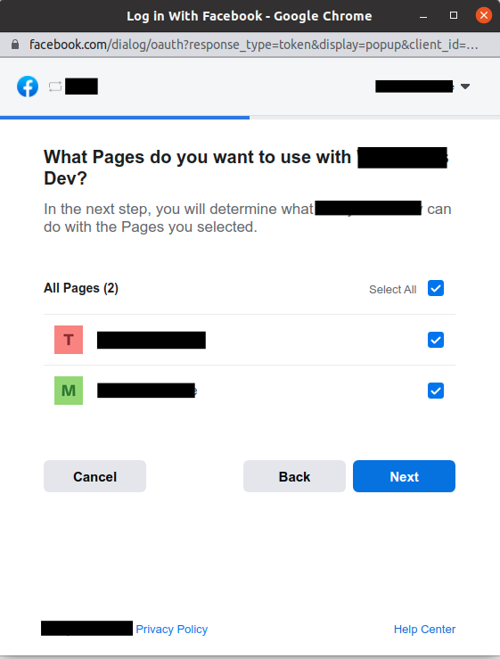
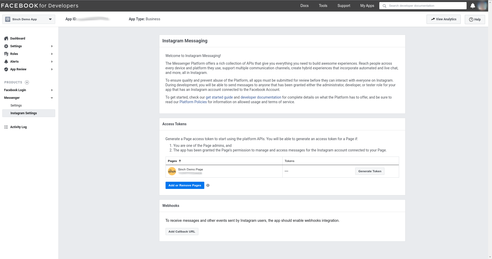

Before you start sending messages using hte Instagram Messaging API, you will need access to the following:

* An Instagram business account, that will receive and send messages
* A Facebook page connected with that account
* A Facebook developer account that can perform tasks on that page
* A registered Facebook App with basic settings configured
* An Instagram Authentication Token

### Creating an Instagram Business Account

On Instagram, you can convert your personal profile to a business account or create a new one following
this [guide](https://www.facebook.com/business/help/502981923235522).

Only business accounts can send and receive messages using the Conversation API Instagram integration.

> 📘 If you already have an Instagram business Account your can skip this step.

### Creating a Facebook Page

In order to send and receive message using the Instagram Message API, you need a Facebook Page that should be connected
to your Instagram business account. You can learn how to create a Facebook
page [here](https://www.facebook.com/business/help/104002523024878).

> 📘 If you already have a Facebook Page your can skip this step.

### Creating a Facebook App

In order to set up the Instagram Messaging API, you should create a Facebook App, following
this [guide](https://developers.facebook.com/docs/development/create-an-app/).

> 📘 If you already have a Facebook App your can skip this step.

> 🚧 By now, Instagram Messaging Product is allowed as a Closed Beta integration, so, in order to add
> the Instagram Messaging product to your Facebook App, you should contact us.

### Connecting the Facebook Page to the Instagram Business Account

* Access the settings sections of your Facebook Page

* Access the Instagram section

* Click "Connect button" and login to you Instagram business Account

* Now your Instagram account is connected to your Facebook Page.

### Enabling Connected Tools in Instagram Business Account

In order to send messages using the Instagram API you should enable connected tools in the Instagram business account,
just follow these steps:

### Generating the Instagram Access Token

* Access "developers.facebook.com" and select your App.

* Click "Add or Remove Pages" and select your Instagram Business Account and your Facebook Page.

* Now you can visualize all the Facebook Pages that are connected to your Facebook App.

* Click "Generate Token" to generate an Instagram Access Token to the Facebook Page connected to a Instagram Business
  Account that you want to send and receive messages using an API.

Now you can use the generated Instagram Access Token
to [set up your Conversation API Instagram integration](doc:conversation-instagram).