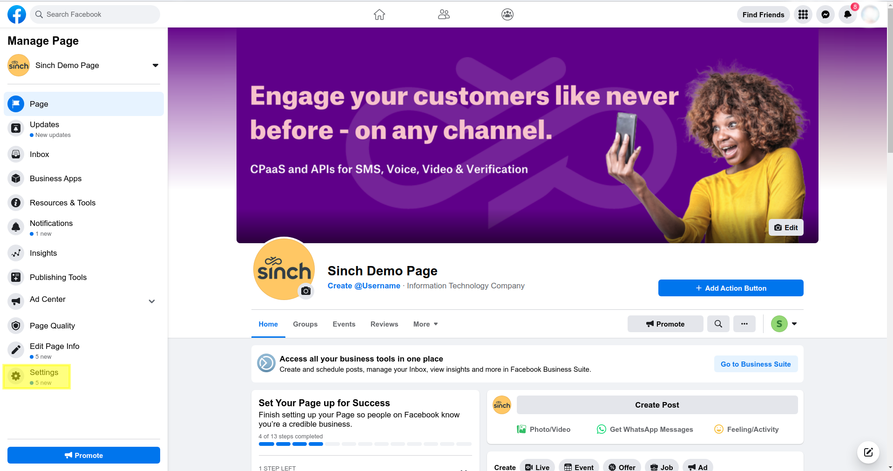
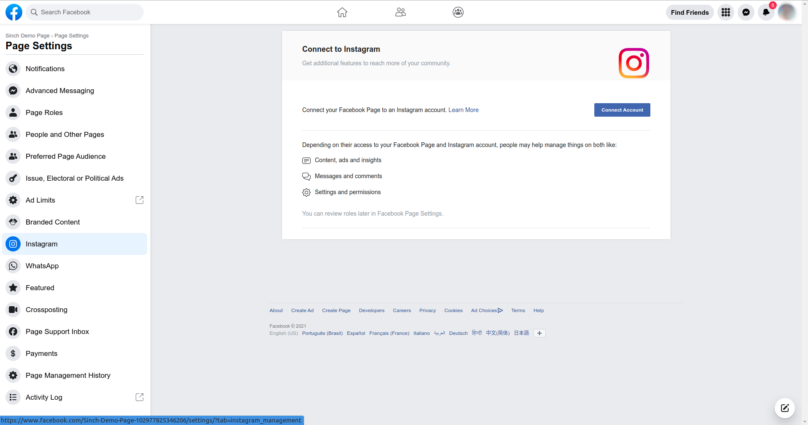
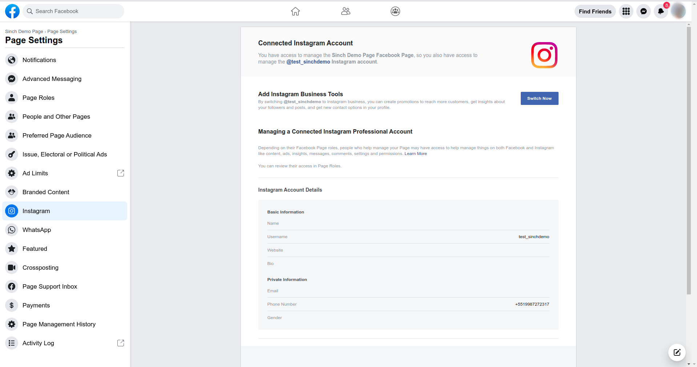

Before you start sending messages using the Instagram Messaging API, you will need access to the following:

* [An Instagram business account that will receive and send messages](#create-an-instagram-business-account)
* [A Facebook page connected with that account](#create-a-facebook-page)
* A Facebook developer account that can perform tasks on that page
* [A registered Facebook App with basic settings configured](#create-a-facebook-app)
* [An Instagram authentication token](#generate-the-instagram-access-token)

> 🚧 Warning
>
> Instagram Messaging Product is only available as a Closed Beta integration. To add the Instagram Messaging product to your Facebook App, you should contact us.
> 
> For testing purposes, you can enable Instagram without asking permission by just creating or renaming an account with "test_" as a prefix to your username.
> 
> ex: @test_Sinch
> 
> Test accounts will only receive Instagram webhooks from users that are added as a tester, developer or admin of the Facebook App linked with the Instagram Account.
> 

### Create an Instagram Business Account

> 📘 Note
>
> If you already have an Instagram business Account you can skip this step.

On Instagram, you can convert your personal profile to a business account or create a new one following this [guide](https://www.facebook.com/business/help/502981923235522).

Only business accounts can send and receive messages using the Conversation API Instagram integration.

### Create a Facebook Page

> 📘 Note
>
> If you already have a Facebook Page you can skip this step.

To send and receive message using the Instagram Message API, you need a Facebook Page connected to your Instagram business account. You can learn how to create a Facebook page [here](https://www.facebook.com/business/help/104002523024878).

### Create a Facebook App

> 📘 Note
>
> If you already have a Facebook App you can skip this step.

To set up the Instagram Messaging API, you need a Facebook App. If you need to create one, follow this [guide](https://developers.facebook.com/docs/development/create-an-app/).

### Connect the Facebook Page to the Instagram Business Account

1. Access the settings sections of your Facebook Page.

   

2. Navigate to the the Instagram section and Click the **Connect Account** button and login to your Instagram business account. 

   

4. Your Instagram account is now connected to your Facebook Page.

   

### Enable Connected Tools in Instagram Business Account

In order to send messages using the Instagram API you must enable **Connected Tools** in the Instagram business account.

1. In the Instagram app Settings menu, navigate to the **Privacy** section.
2. In the **Privacy** menu, navigate to the **Messages** section.
3. In the **Message Controls** menu, enable **Allow Access to Messages** under the **Connected Tools** section.

### Generate the Instagram Access Token

1. Log in to developers.facebook.com and select your App.

   

2. Click **Add or Remove Pages** and select your Instagram Business Account and your Facebook Page.

   

3. On this page, you can see all the Facebook Pages that are connected to your Facebook App.

   

4. Click the **Generate Token** button to generate an Instagram Access Token.

> 📘 Note
>
> In order to generate a token, the Facebook Page must be connected to an Instagram Business Account.

   

Now you can use the generated Instagram Access Token to [set up your Conversation API Instagram integration](doc:conversation-instagram).
