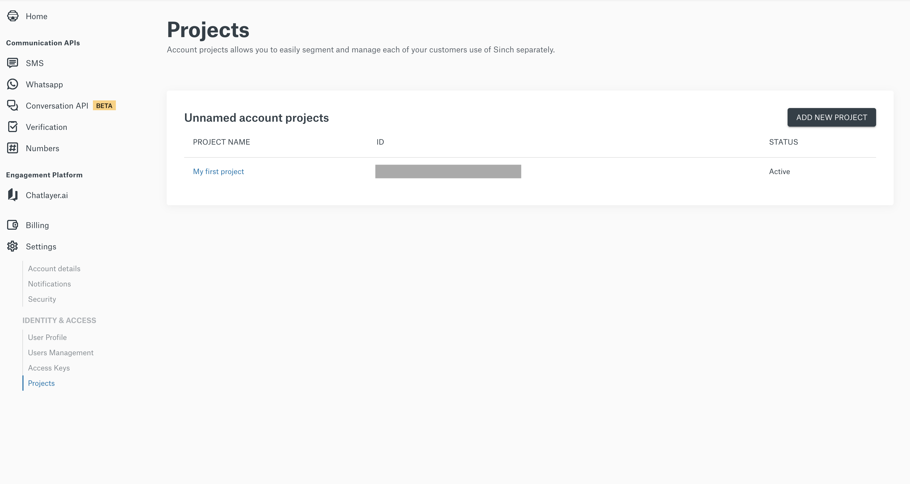
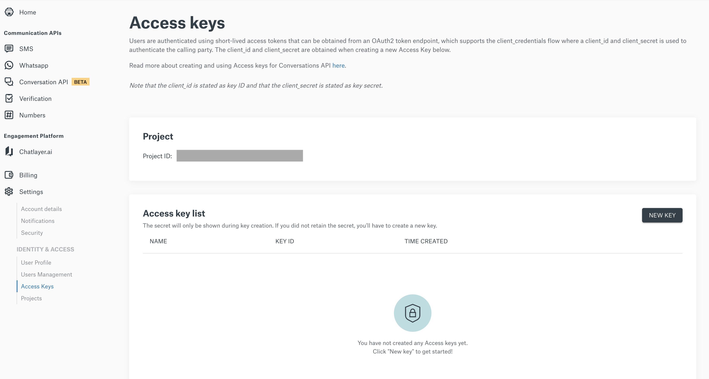

## Authentication

To authenticate with the numbers API You need get a project id, client id and key id you will need to log into your self-serve account (dashboard.sinch.com) and visit https://dashboard.sinch.com/settings/project-management.

Then go Access Keys section https://dashboard.sinch.com/settings/access-keys. Here you need to click the “New Key” to generate an client id and key id.

Make sure to write down the key since it will not be possible to retrieve after creation

### Basic

Our basic security works with any project, its the client_id and client_secret that you can find in the dasbhoard.

#### Oauth

Our basic security works with any project, its the client_id and client_secret that you can find in the dasbhoard This is the recomended way of to access our apis.

Security Scheme Type OAuth2
clientCredentials OAuth Flow Token URL: https://eu.auth.sinch.com/oauth2/token

Revoke URL: https://eu.auth.sinch.com/oauth2/revoke

