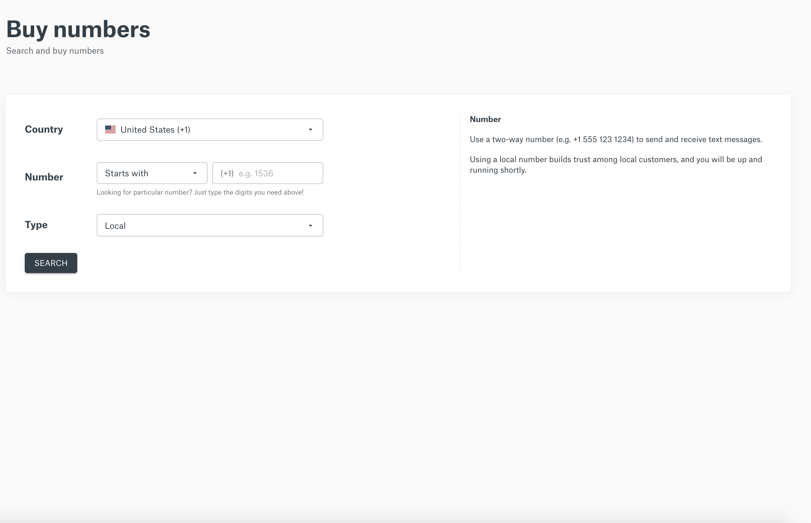
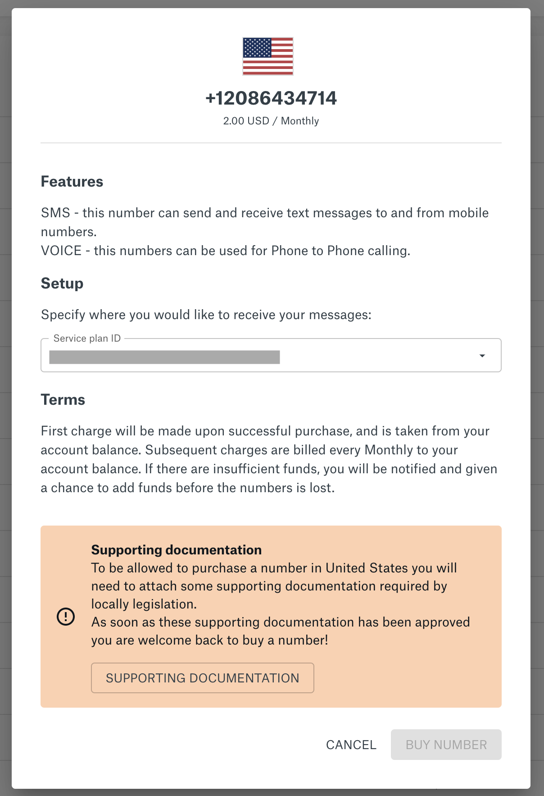
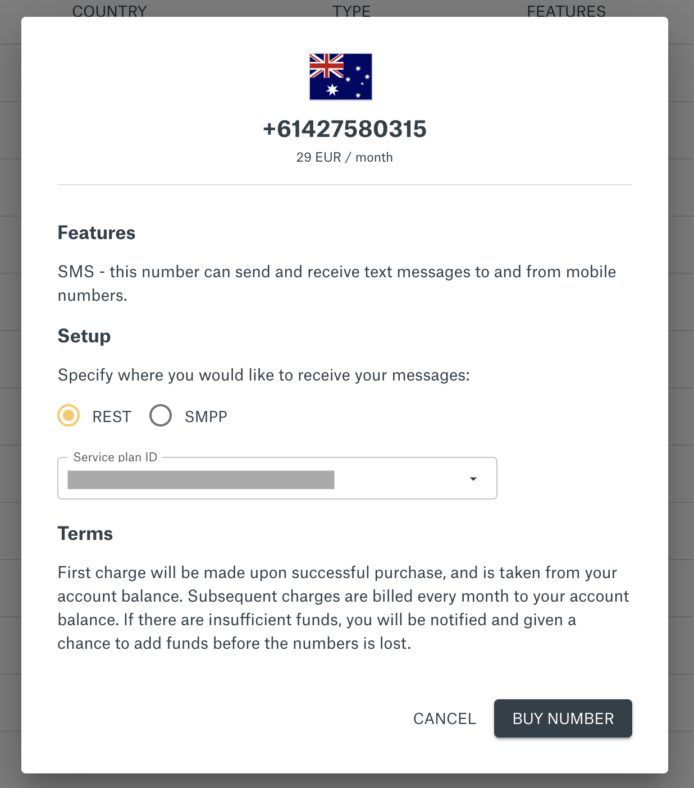
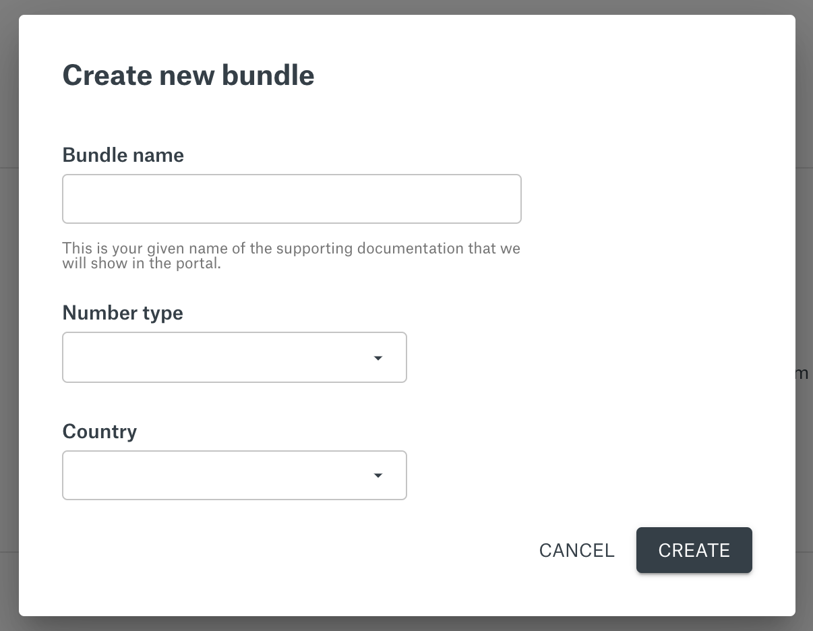

## Your Numbers

List of your numbers

Click on a number will take you to the numbers details

Here you can view details and configure your SMS settings

## Buy Numbers

Search numbers

You can use different search criteria like country, type and feature (SMS, Voice or both). All countries where Sinch have numbers in inventory will be marked as “Direct Buy”, all other countries will require you to submit an request to us for manual handling.

When you buy a number some pre-requisits may be needed depending on the country specific requirements

Pre-requisit needed. See supporting documentation

If no prerequisite is needed, click the buy number button to acquire the number

## Supporting Documentations

In some countries you will need to submit additional documentation before you buy a number. This is done in the “Supporting Documentation” section.

First, click the “New Bundle” button

Fill in a name (you may name the request anyway you like), type and select the country where you want to buy the number in.

Fill in the bundle details and when done click the “Submit to review” button.In many cases the bundle will be approved instantly but in some cases a manual approval will be needed. If so, you will be notified when bundle is approved by E-mail
